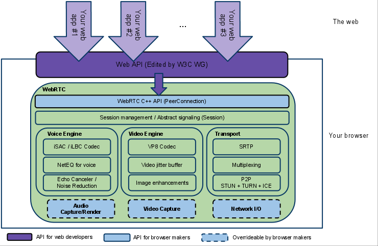
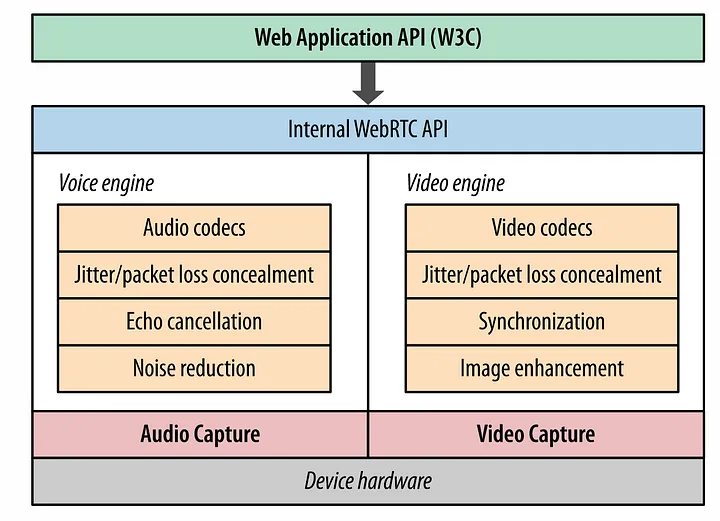

# WebRTC Overview

- WebRTC is the core protocol that lets you do real time media communication from inside a browser
- Majority of the applications in internet are based on Client-Server architecture, which requires your data to be routed through a server.
- So to make this communication peer to peer and avoid the use of server, we have WebRTC, that fecilitates peer to peer communication without requiring any server.

- WebRTC is the collection of protocols, that works hand to hand to establish a peer to peer exchange of audio, video and data between the browsers.
- In webapps we can use it using these javascript apis
  - MediaStream
  - RTCPeerCommunication
  - RTCDataChannel
  
- WebRTC uses UDP at core for providing adaptive streaming (websockets is a good example). UDP is faster than TCP and often used for real time communication as it doesnt require to establish a connection before sending the data
- Due to this UDP is also highly unreliable and requires additional logic on top of it, so to use it for real time communication

- WebRTC provides near to 0.1s delay
- HLS has around 10s delay

# Working of WebRTC

- In order to understand the working of WebRTC, we are required to understand the architecture of it

## The first stage in the WebRTC architecture is `Web API`

### Web API layer

- Maintained by W3C
- They are just Javascript APIs, that are developed and used by application developers for creating rtc applications on top of browsers.

- Conection btw 2 peers are represented by the `RTCPeerConnection` interface.
- Once the connection is established and opened between the users, `MediaStream` and `RTCDataChannel` can be added to the connection.

- MediaStream can consist of any number of tracks of media information,that are represented by objects based on the `MediaStreamTrack` interface.
- It may contain one of a number of types of media data such as audio, text, and video.
- WebRTC can be used for sharing data between the peers too (its what had powered Holochain), using the RTCDataChannel interface.

## The second stage is WebRTC `C++ API`

- It allows for implementing the javascript based WebAPI
- Allows browsers to implement the peer connection apis
- It manages the full lifecycle of establishing and maintaining the peer to peer connection btw 2 browsers
- It encapsulates all of the connection management, setup, session state and data delivery

From here WebRTC splits into 3 different verticles, one is voice processing, one is video processing and one is connection management and transport

## The 3rd stage

For basic media conferencing application we are required to:

- **Acquire** the Audio / Video stream of the users for communication.
- This acquiring of stream is handled by `MediaStream` API

- After acquiring video / audio stream, we are then required to **prcoess** the user stream while maintaining the quality and synchronisation between the audio, video packets.
- We also have to adjust the bitrate dynamically to adapt to unpredictable bandwidth between users.

- After processing, we have to finally **decode**, when the peer receives the streams.
- We have to decode and process the stream for network jitter and packets loss.

- For doing all of this, WebRTC uses its own Audio and Video Engines under the C++ API layer

### Stage 3.1 `Voice Engine`

- Its a framework for browser to implement audio media capture.
- It handles audio capturing from sound card to all the way up to transporting the data captured from sound card over the n/w
- Its composed of different standards that handles different tasks.
- Firstly there are Audio Codecs (iSAC, iLBC and Opus).
- Secondly echo cancellation algorithms.
- Lastly a noise reduction component.

1. Codecs

    - **Internet Speech Audio Codec (iSAC)**
      - Developed by Global IP Solutions.
      - Used by VoIP
      - Used in low bitrate, jittery conditions
  
    - **Internet low bit rate codec**
      - Speech code for Narrowband environments
      - Used for VoIP and audio streaming
      - Suited for poor network conditions

    - **Opus**
      - Lossy audio coding format
      - Uses tech developed by Skype
      - Flexible and can handle widerange of audio applications
      - Can scale from low quality streaming to high quality streaming

2. Acoustic Echo Canceler (AEC)

- Signal processor that removes any acoustic echo from the voice.
- Needed as most users will have integrated camera, speaker and microphone.
- So the output in this case will be picked up by the active microphone.
- So we have to do echo cancelling, inorder to reduce the uneven echo feedbacks.

3. Noise Reduction

- Its a signal processing component developed to deal with the common conditions of WebRTC and VoIP deployments.
- It reduces all the noises and enchances the quality of the audio stream.

### Stage 3.2 `Video Engine`

- Similar to what audio engine does, but for video streams
- Captures the raw video from the device's camera and prepare it for transport over the web.
  
1. Codecs

    - **VP8**
      - Video codec taken from WebM
      - Used for developing free and open video foramts from the web
      - Desgined for low latency
      - It provides video compression
      - Other codecs that can be used are vp9, h264, av1

2. Video Jitter Buffer

- Jitter buffer helps in concealing the packet loss.
- Collects and stores the media packets incoming into the buffer.
- Decides when to pass them to the decoder and playback engine.
- Decision is based on the packets waiting for and timing required for the media playback.

3. Image Enhancements

- Image enhancements are dependent on WebRTC impl.
- Removes all the noise from the image it had captured from the web cam.

